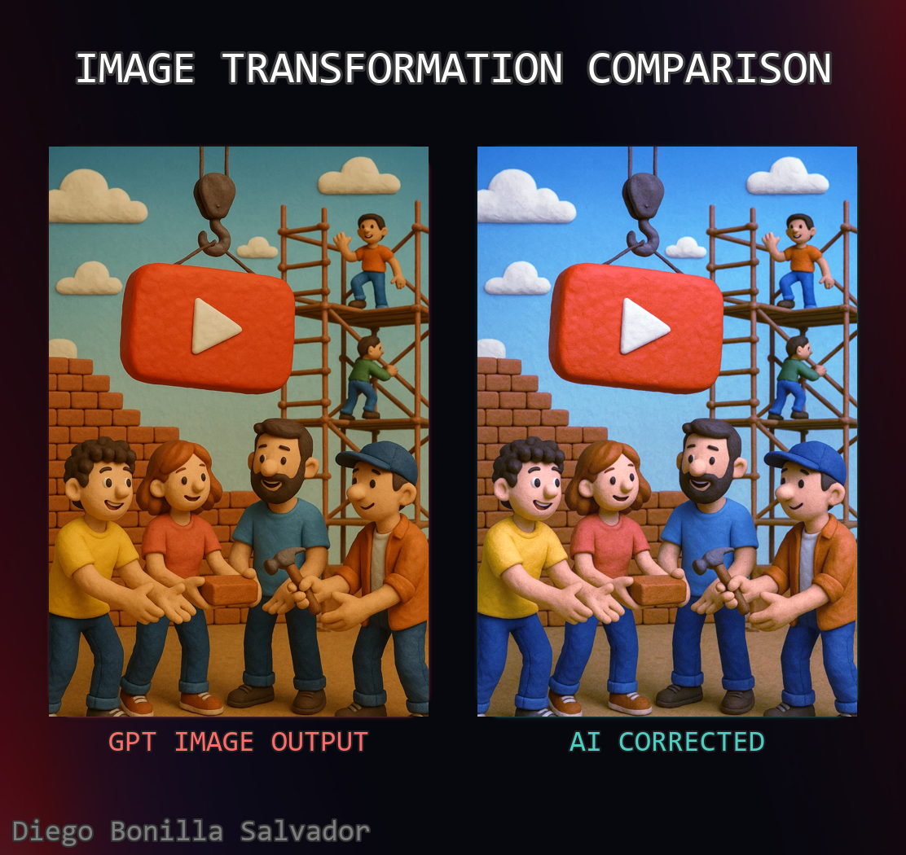
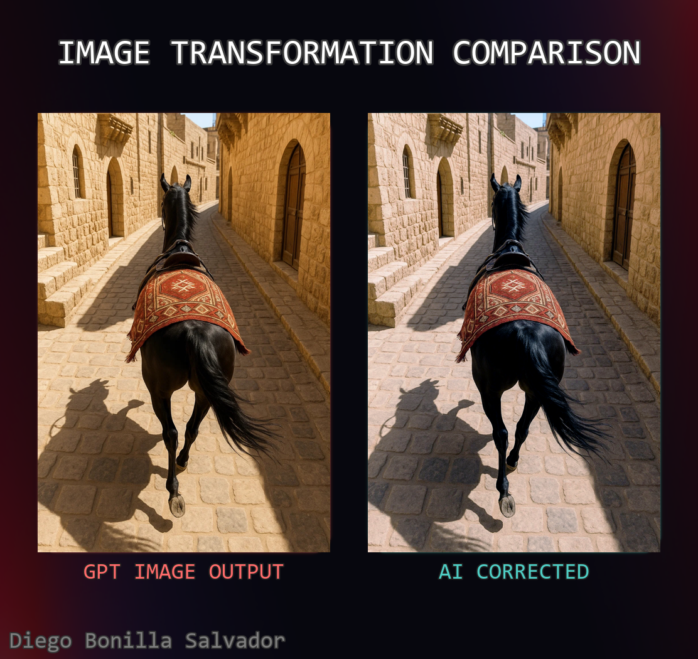
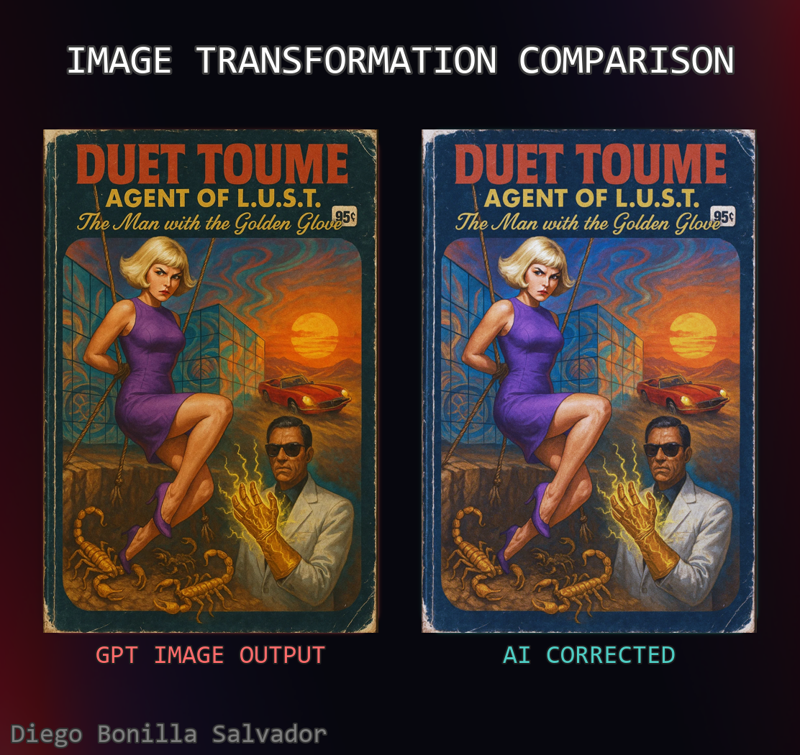
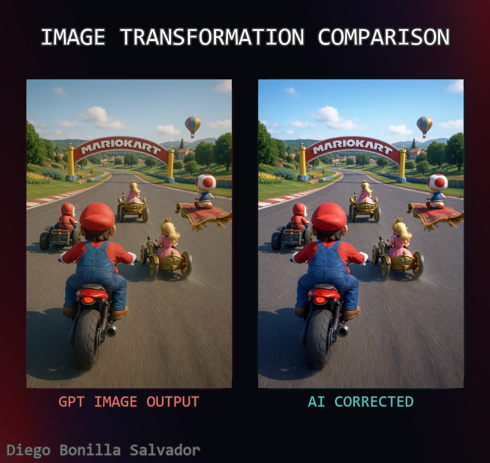

# GPT Image Corrector

**Corrects common visual artifacts in images generated by ChatGPT Image Generator, such as unwanted color casts (e.g., yellow/orange tint) and unnatural sharpness.**

This project utilizes a Transformer-based neural network, treating image correction as a sequence-to-sequence problem at the pixel level. The model learns to transform sequences of pixels from an input image with artifacts into sequences of pixels for a corrected, cleaner image.



## Table of Contents

- [Problem Solved](#problem-solved)
- [How It Works](#how-it-works)
- [Features](#features)
- [Model Details](#model-details)
- [Dataset Handling](#dataset-handling)
- [Configuration](#configuration)
- [Dependencies](#dependencies)

## Problem Solved

Images generated by large AI models, particularly earlier versions or specific styles from GPT Image Generator (often accessed via ChatGPT or Sora), sometimes exhibit consistent visual issues:
1.  **Color Cast:** A noticeable yellow or orange tint across the image.
2.  **Unnatural Sharpness:** An over-sharpened or "crispy" appearance that can look artificial.

This project aims to automatically mitigate these artifacts, producing more visually appealing and natural-looking images.



## How It Works

The core of this project is a `PixelTransformerModel`, a Transformer-based architecture adapted for image processing. Instead of treating the image as a whole or in 2D patches in the traditional CNN sense for this specific task, the model processes images as sequences of pixels.

1.  **Pixel Sequencing:** Input images are broken down into sequences of pixels. For example, a 1D sequence could be a flattened scanline of pixels.
2.  **Transformer Encoder:** These pixel sequences are fed into a Transformer encoder. The self-attention mechanism within the Transformer allows the model to learn complex relationships and dependencies between pixels in the sequence, effectively understanding the context of artifacts.
3.  **Sequence-to-Sequence Correction:** The model is trained to predict the corrected pixel values for each input pixel sequence. This seq2seq approach allows it to learn the mapping from "artifact-laden" pixel characteristics to "clean" pixel characteristics.
4.  **Image Reconstruction:** The processed pixel sequences are then reassembled to form the corrected output image. During inference on a full image (as seen in `train.py`'s `process_reference_image` and implicitly in `inference.py`), predictions for overlapping sequences are averaged to ensure smooth transitions and comprehensive correction.

The `PixelDataset` class (`dataset.py`) is responsible for efficiently loading and transforming images into these pixel sequences for training.

## Features

*   **Automated Artifact Correction:** Intelligently reduces yellow/orange tints and unnatural sharpness.
*   **Transformer-Powered:** Leverages the power of Transformer networks for nuanced pixel-level adjustments.
*   **Gradio Web Interface:** (`app.py`) Provides an easy-to-use interface for:
    *   Uploading images.
    *   Real-time inference.
    *   Adjusting inference parameters (stride).
    *   Blending between the original and corrected image using a strength slider.
*   **Training Pipeline:** (`train.py`) Includes:
    *   Support for custom datasets.
    *   Learning rate scheduling (Vaswani et al., 2017).
    *   TensorBoard logging for monitoring training progress and image outputs.
    *   Checkpoint saving (best model based on validation loss).
*   **Configurable:** Many aspects of the model and training process can be configured via the `CONFIG` dictionary in `train.py`.

## Model Details

The `PixelTransformerModel` (defined in `model.py`) consists of:

*   **Input Projection:** A linear layer that projects the input pixel channels (e.g., 3 for RGB) to the model's internal dimension (`model_dim`).
*   **Positional Encoding:** Standard sinusoidal positional encodings are added to the projected pixel embeddings to provide the model with information about the position of each pixel in the sequence.
*   **Transformer Encoder:** A stack of Transformer encoder layers. Each layer contains:
    *   Multi-Head Self-Attention: Allows pixels to attend to other pixels in the sequence. `nhead` is set to 1 in the current configuration.
    *   Feedforward Network: A position-wise fully connected feedforward network.
*   **Output Projection:** A linear layer that projects the Transformer's output back to the original pixel channel dimension.
*   **Sigmoid Activation:** Ensures the output pixel values are in the range [0, 1].

The model expects input of shape `(BATCH_SIZE, num_pixels, input_dim)`.



## Dataset Handling

The `PixelDataset` class (`dataset.py`) is used to load and prepare data for training:

*   It takes lists of input and output image paths.
*   **Modes of Operation (`DATASET_MODE`):**
    *   `"1D"`: Extracts sequences of `num_pixels` by scanning the image row by row, wrapping around. Samples are generated with a given `stride_length`.
    *   `"2D"`: Extracts `sqrt(num_pixels) x sqrt(num_pixels)` patches. `num_pixels` must be a perfect square.
    *   `"RAND"`: Randomly samples `num_pixels` from the image.
*   Applies transformations (e.g., `transforms.ToTensor()`).
*   Caches image dimensions to optimize loading.

## Configuration

Key configuration parameters are centralized in the `CONFIG` dictionary at the top of `train.py`.

```python
# Example from train.py
CONFIG = {
    "NUM_EPOCHS": 50,
    "BATCH_SIZE": 256,
    "PEAK_LEARNING_RATE": 1e-4,
    "WEIGHT_DECAY": 0.01,
    "MODEL_DIM": 256,
    "NUM_LAYERS": 4,
    "NHEAD": 1,
    "DIM_FEEDFORWARD": 1024,
    "DROPOUT": 0.1,
    "NUM_PIXELS": 128,       # Sequence length for the transformer
    "INPUT_DIM": 3,          # Number of image channels (e.g., 3 for RGB)
    "DATASET_MODE": "1D",    # "1D", "2D", or "RAND"
    "DATASET_STRIDE": 64,    # Stride for generating samples in "1D" or "2D" mode
    "WARMUP_STEPS": 4000,

    "INPUT_DIR_TRAIN": "inputs",
    "OUTPUT_DIR_TRAIN": "outputs",

    "REFERENCE_IMAGE_PATH": "./assets/task_01_img_0.png", # Example reference image
    "REF_IMG_INFERENCE_BATCH_SIZE": 128,

    "CHECKPOINT_DIR": "checkpoints",
    "TENSORBOARD_LOG_DIR": "runs/pixel_transformer_experiment",
    "NUM_WORKERS": min(os.cpu_count(), 4),
    "VAL_SPLIT": 0.1,
}
```

## Dependencies

*   Python 3.x
*   PyTorch (`torch`, `torchvision`)
*   Pillow (`PIL`)
*   Gradio (`gradio`)
*   NumPy (`numpy`)
*   tqdm (`tqdm`)
*   TensorBoard (`tensorboard`)
*   imwatermark (`imwatermark`)

See [Setup](#setup) for installation instructions.


